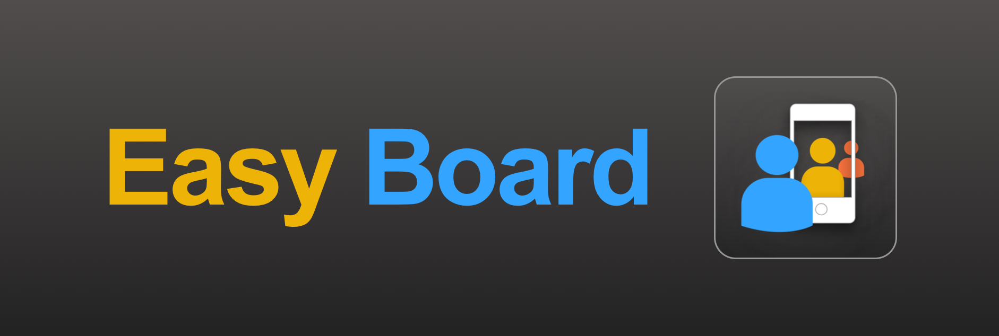
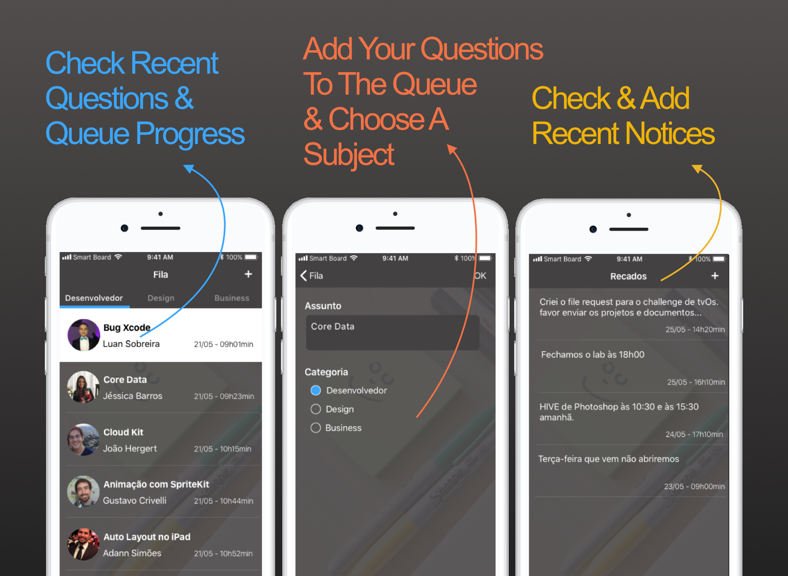
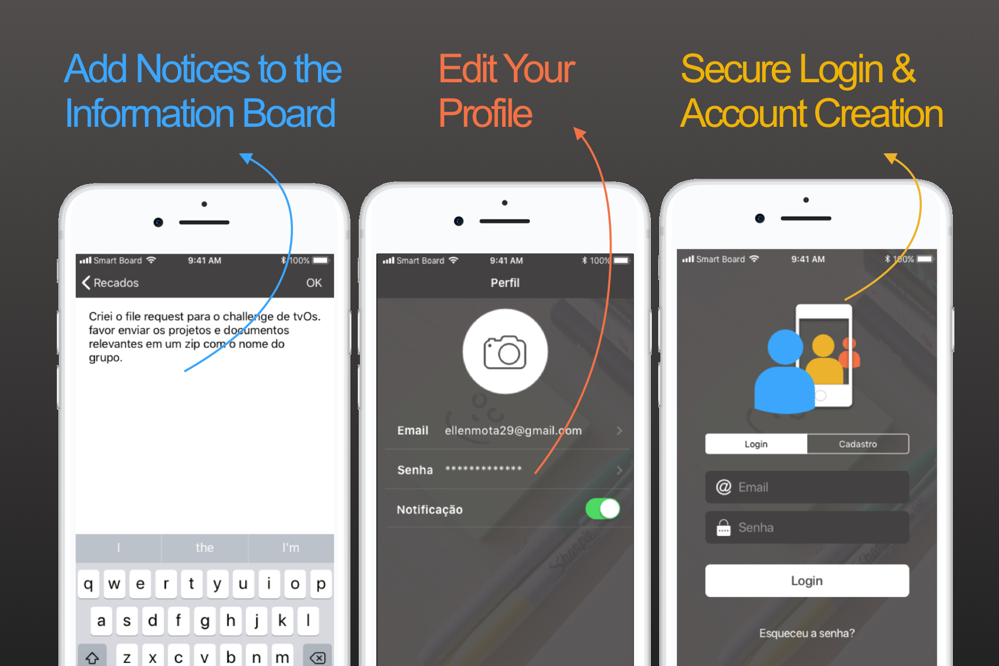
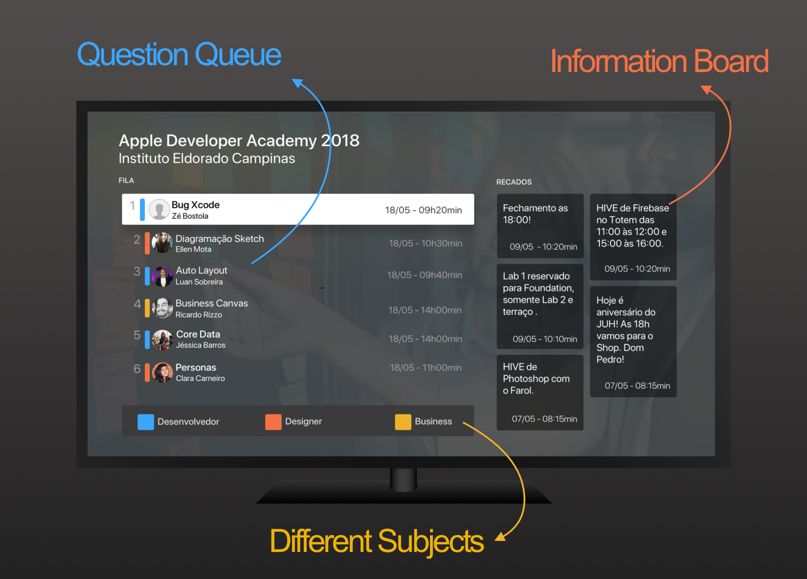
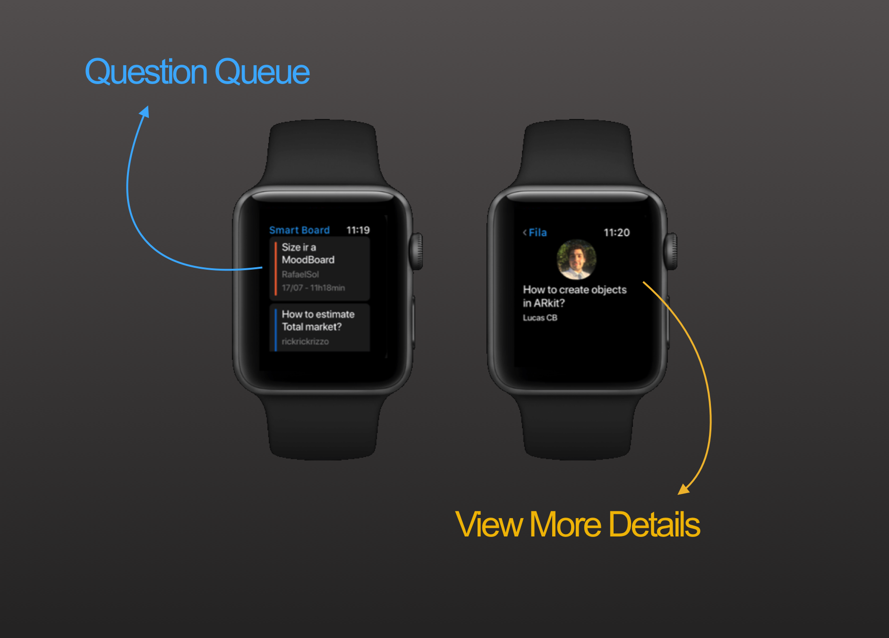

# EasyBoard *(FilaFácil)*

## Description
An iOS App that extends from iOS to TvOS and WatchOS to optimize the user experience while sharing they dificulties with the team. This tool makes overcoming & learning challenges easier with team effort, where everyone can give support.

## About

The application evolved into an internal tool for the Apple Developer Academy at Eldorado, enhancing flexibility and agility within the learning process. Additionally, we showcased the project at the Mobile Campus hackathon, competing for "best learning solution".

### Overview

Find an extensive option of features with real examples so you can try them for yourself while using the app. 
- See how the queue is progressing in each subject and check if there is any questions you can help with
- Create a question and enter the queue in a specific subject
- Check recents news in the notice board

Also enjoy other importante features!
- Create notices to inform all your collagues
- Edit your profile to change photo, update e-mail & password or toggle notifications
- Feel safe to login & create new account

Our key feature counts on the AppleTv, where you can see all the recent notices and visualize all the questions in the queue & their subject.
> All this information is displayed in real time

We also have a feature is beta where it's possible to check the queue and questions on your Apple Watch!
> The WatchOS was implemented to help the seniors receive notifications and follow up on questions.

> Have an ideia for a new feature? [Submit an issue](https://github.com/LucasCBarros/MegaDevs/issues/new).

### Technical Overview

- The information is saved in Firebase where we store user data as JSON and images
- The data is persisted using the DAO.
- The authentication is also using Firebase
- We opted a simple MVC Architecture
- There is a separate target for TvOS and another for WatchOS
- Swift version: 3.0

### Known Issues & Improvements: 

- Firebase needs to be reconfigured (We had plans to re-implement the BE using iCloud)
- The Project uses storyboards but separated in different files to reduce conflicts.
- The Unit Tests still have very low coverage.
- We had plans to work on the localizable strings to make the project more accessible.
- We tried keeping all the code and commentaries in english (But there might be something still in portugues, feel free to contact me)

## How to run

### Requirements
- Xcode 9.0+

### Getting Started
- Clone this repository
- run *$ pod init* and *$ pod install*
- Open the .xcodeproj and you are good to go.

## Contributing

Feel free to [open an issue](https://github.com/LucasCBarros/MegaDevs/issues/new) or [submit a pull request](https://github.com/LucasCBarros/MegaDevs/compare) if you have any improvement or feedback.

### Author

Lucas Barros, LucasCavalcanteDeBarros@gmail.com.
